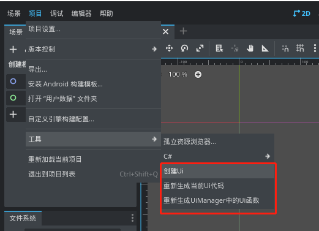
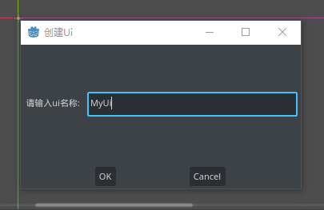
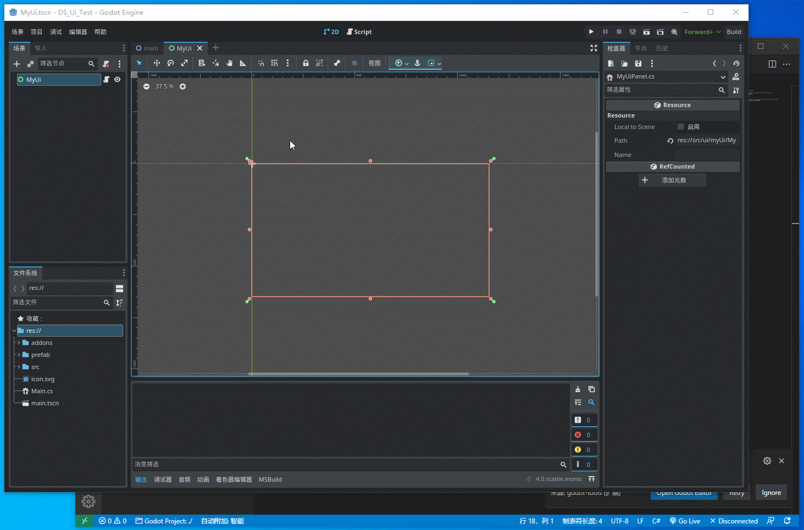
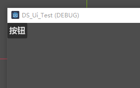

# DsUi

适用版本: Godot Mono 4.x

---
`DsUi`是一款用于`Godot Mono`快速开发Ui的插件, 核心功能如下:
* 提供Ui管理器`UiManager.cs`, 负责管理Ui生命周期
* 根据Ui场景自动生成Ui节点属性代码, 支持生成唯一名称节点属性
* 根据Ui场景文件自动生成打开Ui/关闭Ui/获取实例的函数
* 支持Ui嵌套, 提供动态打嵌套Ui函数和场景内静态嵌套Ui功能
* 提供Ui网格布局组件(`UiGrid.cs`), 更方便管理单个Cell
* 支持类似Unity中的协程函数

---
### 使用该插件的意义
众所周知, 使用C#开发Godot游戏, 无法像GDS那样有原生特性支持(`$+节点名称`), C#获取节点必须使用`GetNode()`函数, 或者`[Export()]`节点属性, 再到编辑器中拖拽赋值. 这样编写很麻烦, 如果使用`GetNode()`来获取节点, 场景中该节点移动位置或者更改名称, 那么`GetNode()`就无法获取到该节点, 这个时候就需要手动更改传入的节点路径, 当项目小还比较好改, 但是大项目重构节点, 那么代码需要更改的地方就非常多, 而且无法快速定位到哪些`GetNode()`函数需要更改.  
在开发Ui时, 因为需要频繁获取节点, 上面的问题就会被放大  
DsUi插件就是为了解决这个问题, **在编辑场景完成后动态生成节点代码**, 这样代码中如果有引用更改, 就可以根据报错立刻定位到需要修改的位置 (不怕编译时报错, 就怕运行时才报错)

---
### 快速开始
1. 安装插件
   * 下载源代码后, 将`addons/ds_ui`复制到你的工程的`addons/ds_ui`目录下
   * 点击编辑器右上角的`Build`
   * 在`项目/项目设置/插件`中启用`Ds_Ui`插件  
   如果插件正常被启用, 则可以在`项目/工具`目录下看到`创建Ui`, `重新生成当前Ui代码`, `重新生成UiManager中的Ui函数`这三个选项  
     

2. 快速创建Ui
    * 点击`项目/工具/创建Ui`, 输入Ui名称, 点击创建, 教程Ui名称以`MyUi`为例  
      
    创建成功后会自动创建Ui场景和Ui脚本文件  
    * 此时编辑Ui场景, 插件会实时生成对应的Ui节点代码  
      
    * 代码操作Ui
    ```csharp
    //获取指定节点, 命名规则: L_ + 节点名称
    var button = L_Control.L_Button;
    //注意, 此时的对象是包裹类型, 需要从 Instance 属性中获取原生节点对象
    button.Instance.Pressed += () =>
    {
        
    };
    
    //如果 Button 是场景中唯一名称的节点, 那么获取 Button 节点可以使用 S_ + 节点名称 缩写方式
    S_Button.Instance.Pressed += () =>
    {
        
    };
    ```
    * 创建Ui时会在`UiManager`下自动创建打开Ui的函数, 那么打开Ui只需要调用以下代码
    ```csharp
    UiManager.Open_MyUi();
    ```
    * 最后运行效果  
    

### 样例
本仓库包含样例代码, 入口文件为`example/Example.cs`  
视频教程: https://www.bilibili.com/video/BV1Xp4y1c7p9